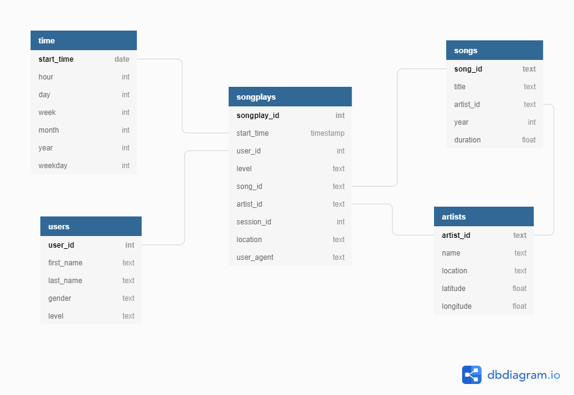

## Project: Data Warehouse

## Introduction
A music streaming startup, Sparkify, has grown their user base and song database and want to move their processes and data onto the cloud. Their data resides in S3, in a directory of JSON logs on user activity on the app, as well as a directory with JSON metadata on the songs in their app.

The task is to build a ETL pipeline that extracts data from S3, stages them in Redshift, and transforms data into a set of dimensional tables for their analytics team to continue finding insights in what songs their users are listening to. Test the database and ETL pipeline by running queries given to you by the analytics team from Sparkify and compare your results with their expected results.

## Project Description
Using data warehouses and AWS to build an ETL pipeline for a database hosted on Redshift. To complete the project, data was loaded from S3 to staging tables on Redshift and SQL statements executed that created the analytics tables from these staging tables.

## Project Steps

## 1 Create Table Schemas
Using the song and event datasets, a star schema was created and optimized for queries on song play analysis. This includes the following tables.

### Fact Table
1. **songplays** - records in event data associated with song plays i.e. records with page NextSong 
    - *songplay_id, start_time, user_id, level, song_id, artist_id, session_id, location, user_agent*
   
### Dimension Tables
2. **users** - users in the app
    - *user_id, first_name, last_name, gender, level*
3. **songs** - songs in music database
    - *song_id, title, artist_id, year, duration*
4. **artists** - artists in music database
    - *artist_id, name, location, lattitude, longitude*
5. **time** - timestamps of records in songplays broken down into specific units
    - *start_time, hour, day, week, month, year, weekday*

Here's an image of the completed star schema:

- SQL CREATE statements for each of these tables were created in in [sql_queries.py](https://github.com/riched158/UdacityDataEngineering/blob/master/datawarehouse/project3/sql_queries.py)
- [create_tables.py](https://github.com/riched158/UdacityDataEngineering/blob/master/datawarehouse/project3/create_tables.py) was completed to connect to the database and create/drop these tables
- A redshift cluster was launched and a IAM role created that has read access to S3.
- Query Editor was used in the AWS Redshift to check the table schemas in the redshift database

## 2. Build ETL Pipeline
- **etl.py** was used to load data from S3 to staging tables on Redshift.
- **etl.py** was used to load data from staging tables to analytics tables on Redshift.
- Used analytic queries on the Redshift database to compare results with expected.
- The redshift cluster was deleted when finished.

